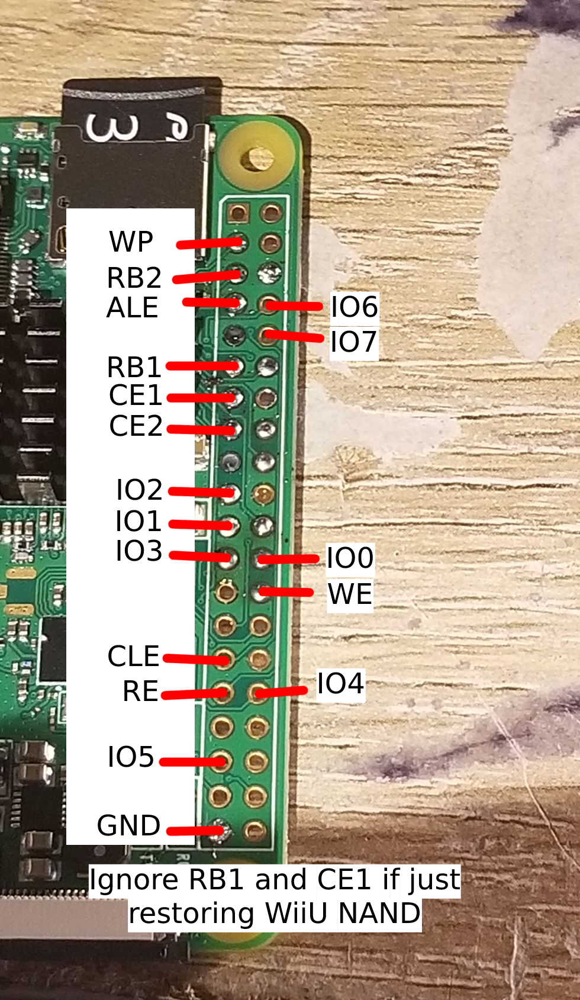
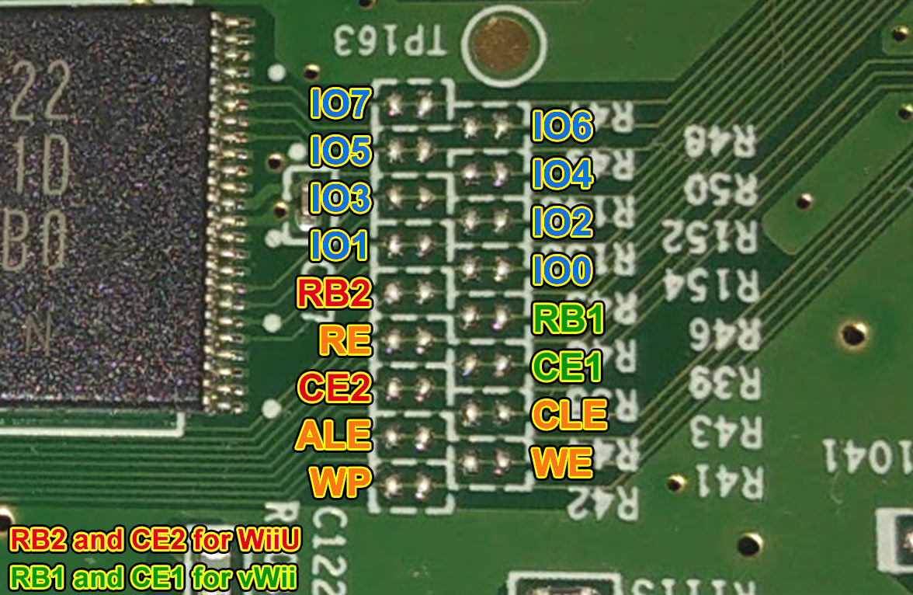
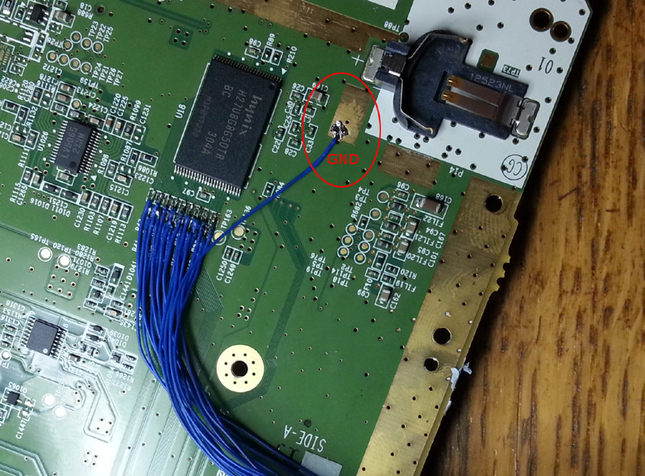
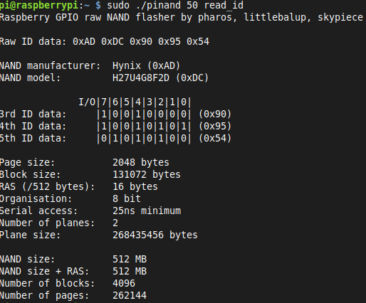

# Read this!!!

This guide is now outdated since there is a software exploit that allows unbricking without soldering! There is a guide for it [here](https://gbatemp.net/threads/cbhc-unbrick-guide-without-soldering.613371/). UDPIH will not work if you somehow deleted OSv10 (00050010-1000400A), so you *must* hardmod the system.

## Start

Hello and welcome to the new and improved ~~freddy fazbears pizza~~ Wii U Unbrick Guide. This Guide only covers the SLC (Wii U).  

Usually if you need to restore vWii NAND, there is [vWii NAND Restorer](https://gbatemp.net/threads/release-vwii-nand-restorer.560948/) (Needs backup) or [vWii Decaffenator](https://gbatemp.net/threads/vwii-decaffeinator-restore-vwii-without-a-nand-backup.566252/) (Doesn't need backup)

Wii U doesnt have something like that yet though. so we have to open up the console and solder some wires to the NAND.

To unbrick the Wii U we will use an Rasberry Pi. I have only ever used an RPi0 and been successful (RPi2B did not work) but the pinouts should be the same on every RPi. If you want to use a Teensy to unbrick, refer to [this guide](https://gbatemp.net/threads/guide-kaflukes-hardmod-cbhc-unbrick-guide.476725/)

## What you need
- An slc.bin dump from *before* the brick, or an otp.bin dump.  
- A Raspberry Pi and MicroSD for the Raspberry Pi.  
- Decent soldering equipment.  
- Decent soldering skills.  
- Ability to follow instructions.  
- A Lot of time.  
- A Decent understanding of Linux.
- Last but not least, A Brain.

### Setting up the software
1. Set up RPIOS on a MicroSD. (Guide: [https://www.raspberrypi.com/documentation/computers/getting-started.html](https://www.raspberrypi.com/documentation/computers/getting-started.html))
1. Power on your RPI and connect it to the internet.  
1. Open up a terminal (`CTRL ALT T`) and run `wget https://raw.githubusercontent.com/Lazr1026/unbrick/main/pinand.sh && chmod +x pinand.sh`
1. Now run `./pinand.sh`.

### Solder the RPI to Wii U board
1. Take apart the Wii U, look up a teardown.  
- Make sure you are VERY CAREFUL when soldering to these points. one mess up and your console may be dead for good.  
Solder Points:  
RPI:  
  
Wii U Board:  

- It should look like this when finished.   

## Fixing the NAND

Note: Now depending on what the hell you did, you could be doing something WAY different (ie. only restoring certain pages). We will be flashing back an entire SLC image here.  

### FIXING THE NAND WITH ONLY OTP.BIN  

Download [Eyekeys NAND Tools](https://github.com/koolkdev/wiiuqt/releases/tag/v0.2) and extract the zip somewhere on your PC.

1. Put the Wii U back together enough to get everything plugged in (Disc Drive, Power Button, Fan, Heatsink.)  
1. Power on the Wii U.  
1. Turn on the RPI.  
1. Open up a terminal and run `sudo ./pinand 50 read_id`, you should get something like this.  

1. Run `sudo ./pinand 50 read_full 0 262144 slc.bin`.  
1. Wait for it to finish reading. (DO NOT UNPLUG THE WII U OR RPI.)  
1. Turn off the Wii U and RPI, insert the RPI' MicroSD in your PC.  
1. Copy the `slc.bin` from `sd:/home/[USER]` to the NAND Tools folder on your PC. (Hint: Now would be a REALLY good time to copy otp.bin to the folder as well.)  
1. Open a Command Prompt and run `nandCbhcRemover.exe slc.bin`. 
See the next section for flashing the NAND back to the Wii U.

### FIXING THE NAND WITH ONLY SLC.BIN  
1. Insert the RPI' MicroSD in your PC.  
1. Copy `slc.bin` to `sd:/home/[USER]`. (OTP Only Users: Click `Replace` when asked.)  
1. Insert the RPI' MicroSD into the RPI.  
1. Turn on the Wii U.  
1. Turn on the RPI.  
1. Open a terminal and type in `sudo ./pinand 50 read_id`. You should get something like this.  
  
1. Run `sudo ./pinand 50 erase_blocks 0 4096 && sudo ./pinand 50 write_full 0 262144 slc.bin`.   
1. Wait for it to finish, this will take a LONG time (around 2 days for an RPi0). (DO NOT UNPLUG THE WIIU OR THE RPI.)  

## After Flashing  
1. Turn off the Wii U.  
1. Turn off the RPI.  
1. Put the Wii U back together enough to test if it boots, plug in Disc Drive, Power Button, Fan, Heatsink.  
1. Turn on the Wii U, connect an HDMI or AV (or if your Gamepad is still paired, that works too).  

- If it loads to Wii U Menu, congrats, desolder the wires on the Wii U Board and put the system back together. You have successfully done the RPI Hardmod Method.  
- If it does not load to Wii U Menu and Errors, then you did something wrong, or you used the wrong backup. Try Flashing again, or join [Ivy's Stuff](https://discord.gg/HNDcTEkcR3) and ask for help in `#help`
	
## Credits:  
[rw-r-r-0644](https://github.com/rw-r-r-0664) - sending me an edited pinand and fixing it.  
[GaryOderNichts](https://github.com/GaryOderNichts) - Emotional support while doing the hardmod.  
[Nightkingale](https://github.com/Nightkingale) - Same thing as Gary.  
[The 4TU Discord server](https://discord.com/invite/F2PKpEj) - For being awesome. ;)  
[RPi Forums](https://forums.raspberrypi.com/) - Having a thread on [Bit-Banging a TSOP NAND.](https://forums.raspberrypi.com/viewtopic.php?t=16775)  
agilly1989 - Sent me the forum and emotional support.  
All of my other friends on Discord - You know who you are.  

You can find the source on [Github](https://github.com/Lazr1026/unbrick/).
