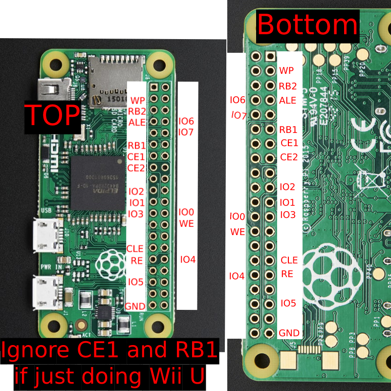
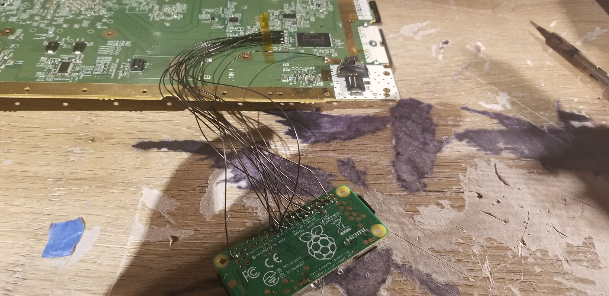

Welcome to the de_Fuse SLC/SLCCMPT Flashing guide. While it does still require soldering, it is far easier than soldering directly to the TSOP and is MUCH faster (10-20min vs. over a day!).

I've also included instructions on how to dump/restore MLC and dump OTP/SEEPROM just to show how powerful this tool is (and to make it a complete NAND Dumping guide for consoles that cannot boot into UDPIH or the traditional nanddumper).

Please note that [UDPIH](https://github.com/GaryOderNichts/udpih) is worth a try before trying this (uses a pico as well so you'd have to buy one anyway).

### What you need {docsify-ignore}
- Raspberry Pi Pico ($4 usually)
- An SD Card. Cannot be SDHC or SDXC. I personally use a 2GB card from a 3DS.
- Some soldering experience
- Recommended to have an SLC/SLCCMPT backup but you can get by with fixing whatever mistake you did without one.

### Set up the SD Card {docsify-ignore}
1. Download the latest release of [de_Fuse](https://github.com/shinyquagsire23/wii_u_modchip/releases) and extract it to your computer.
1. Flash the `boot1.img` to the SD Card using Win32Disk Imager or dd (macOS users are on their own).
1. Format the rest of the SD Card to FAT32.
1. Copy `fw.img` and (optionally) `otp.bin` to the root of your SD Card.
    - You will need `otp.bin` if you want to boot a patched OS with de_Fuse.

### Set up the Pico {docsify-ignore}
1. Hold the `BOOTSEL` button while plugging the Pico into your PC.
1. Copy the `pico_defuse.uf2 ` file to the `RPI-RP2` storage device.

### Wire it all up! {docsify-ignore}
Here is a diagram showing where everything is (Thanks JadeStrike!):

This is what it could look like when finished:

### Booting the console into a de_Fused state {docsify-ignore}
1. Insert the SD Card into the Wii U
1. Connect the WIi U to Power
1. Connect the Wii U to a display over HDMI or to your PC with PuTTY or minicom.
1. Power it on. You should see the minute_minute menu.

### Restoring an SLC/SLCCMPT {docsify-ignore}
1. Copy the `slc.bin` or `slcccmpt.bin` to the root of your SD Card.
1. Rename it so the extention is `.raw` (ie `slc.raw`).
1. Boot the console into a de_Fused state.
1. Navigate to `Backup and Restore` using the POWER button and press EJECT to select it.
1. Navigate to `Restore SLC.RAW` (or `Restore SLCCMPT.RAW`) and select it.
1. Wait for the restore to finish.
1. Once finished, press POWER to go back to the `Backup and Restore` menu.
1. Navigate to `Return to Main Menu` and then `Power off`.
1. Try booting the console. Can be de_Fused or a "normal" boot (if you got this far im sure you can figure out what that means).

### Dumping an SLC/SLCCMPT {docsify-ignore}
1. Boot the console into a de_Fused state.
1. Navigate to `Backup and Restore` using the POWER button and press EJECT to select it.
1. Navigate to `Backup SLC.RAW` (or `Backup SLCCMPT.RAW`) and select it.
1. Wait for the dump to finish.
1. Once finished, press POWER to go back to the `Backup and Restore` menu.
1. Navigate to `Return to Main Menu` and then `Power off`.
1. Copy the dump to your PC.
    - What you do from here to fix the backup is out of the scope of this guide. However, you likely don't have an `otp.bin` dump either if you followed this section, so follow the [Dumping OTP](?id=dumping-otp) section to get one.

### Dumping MLC {docsify-ignore}
!> This requires at least a 64GB/16GB SD Card on 32GB/8GB models respectively.

!> The SD Card will be formatted.
1. Boot the console into a de_Fused state.
1. Take out the current SD Card and insert the SD Card you will be using.
1. Navigate to `Backup and Restore` with POWER and select it with EJECT.
1. Navigate to `Format redNAND` and select it.
1. Press EJECT.
    - It is optional to dump SLC/SLCCMPT.
1. Wait for the redNAND creation to finish (might take a few hours).
1. Press `POWER` to go back to the `Backup and Restore` menu.
1. Navigate to `Return to Main Menu` and then `Power off`.
1. Insert the redNAND SD Card into your PC.
1. Dump the 3rd partition of the SD Card (will be roughly 8GB/32GB) to a file on your PC using the same tools you used to flash the `boot1.img`.
    - What you do from here to fix the backup is out of the scope of this guide.
1. You now have an MLC dump! Yay!

### Restoring MLC {docsify-ignore}
!> This requires at least a 64GB/16GB SD Card on 32GB/8GB models respectively and to have already been formatted with a redNAND (The section above).
1. Boot the console into a de_Fused state.
1. Insert the redNAND SD Card into the console.
1. Navigate to `Backup and Restore` with POWER and select it with EJECT.
1. Navigate to `Restore redNAND` and select it.
1. Press `EJECT` to continue with the restore.
1. Wait for it to finish (might take a few hours).
1. Press `POWER` to go back to the `Backup and Restore` menu.
1. Navigate to `Return to Main Menu` and then `Power off`.

### Dumping OTP {docsify-ignore}
1. Boot the console into a de_Fused state.
1. Navigate to `Backup and Restore` using the POWER button and press EJECT to select it.
1. Navigate to `Dump OTP via PRSHhax` and select it.
1. Wait for the PRSHhax exploit to run. After it you should see a message saying "otp.bin successfully dumped".
1. Navigate to `Power off`
1. Copy the `otp.bin` to your PC.
1. You now have an `otp.bin` dump! Yay!

### Dumping SEEPROM {docsify-ignore}
1. Boot the console into a de_Fused state.
1. Navigate to `Backup and Restore` using the POWER button and press EJECT to select it.
1. Navigate to `Dump SEEPROM and OTP ` and select it.
1. Press `POWER` to go back to the `Backup and Restore` menu.
1. Navigate to `Return to Main Menu` and then `Power off`.
1. Copy the `seeprom.bin` to your PC.
1. You now have a `seeprom.bin` dump! Yay!

### Credits {docsify-ignore}
- shinyquagsire23 for [de_Fuse](https://github.com/shinyquagsire23/wii_u_modchip/tree/main/pico_defuse), [minute_minute](https://github.com/shinyquagsire23/minute_minute), and generally just being helpful when I had troubles restoring.

CLICK HERE FOR OLD RPI FLASHER GUIDE

# Read this!!! {docsify-ignore}

This guide is now outdated since there is a software exploit that allows unbricking without soldering! There is a guide for it [here](https://gbatemp.net/threads/cbhc-unbrick-guide-without-soldering.613371/). UDPIH will not work if you somehow deleted OSv10 (00050010-1000400A), so you *must* hardmod the system.

## Start

Hello and welcome to the new and improved ~~freddy fazbears pizza~~ Wii U Unbrick Guide. This Guide only covers the SLC (Wii U).  

Usually if you need to restore vWii NAND, there is [vWii NAND Restorer](https://gbatemp.net/threads/release-vwii-nand-restorer.560948/) (Needs backup) or [vWii Decaffenator](https://gbatemp.net/threads/vwii-decaffeinator-restore-vwii-without-a-nand-backup.566252/) (Doesn't need backup)

Wii U doesnt have something like that yet though. so we have to open up the console and solder some wires to the NAND.

To unbrick the Wii U we will use an Rasberry Pi. I have only ever used an RPi0 and been successful (RPi2B did not work) but the pinouts should be the same on every RPi. If you want to use a Teensy to unbrick, refer to [this guide](https://gbatemp.net/threads/guide-kaflukes-hardmod-cbhc-unbrick-guide.476725/)

## What you need
- An slc.bin dump from *before* the brick, or an otp.bin dump.  
- A Raspberry Pi and MicroSD for the Raspberry Pi.  
- Decent soldering equipment.  
- Decent soldering skills.  
- Ability to follow instructions.  
- A Lot of time.  
- A Decent understanding of Linux.
- Last but not least, A Brain.

### Setting up the software
1. Set up RPIOS on a MicroSD. (Guide: [https://www.raspberrypi.com/documentation/computers/getting-started.html](https://www.raspberrypi.com/documentation/computers/getting-started.html))
1. Power on your RPI and connect it to the internet.  
1. Open up a terminal (`CTRL ALT T`) and run `wget https://raw.githubusercontent.com/Lazr1026/unbrick/main/pinand.sh && chmod +x pinand.sh`
1. Now run `./pinand.sh`.

### Solder the RPI to Wii U board
1. Take apart the Wii U, look up a teardown.  
- Make sure you are VERY CAREFUL when soldering to these points. one mess up and your console may be dead for good.  
Solder Points:  
RPI:  
  
Wii U Board:  

- It should look like this when finished.   

## Fixing the NAND

Note: Now depending on what the hell you did, you could be doing something WAY different (ie. only restoring certain pages). We will be flashing back an entire SLC image here.  

### FIXING THE NAND WITH ONLY OTP.BIN  

Download [Eyekeys NAND Tools](https://github.com/koolkdev/wiiuqt/releases/tag/v0.2) and extract the zip somewhere on your PC.

1. Put the Wii U back together enough to get everything plugged in (Disc Drive, Power Button, Fan, Heatsink.)  
1. Power on the Wii U.  
1. Turn on the RPI.  
1. Open up a terminal and run `sudo ./pinand 50 read_id`, you should get something like this.  

1. Run `sudo ./pinand 50 read_full 0 262144 slc.bin`.  
1. Wait for it to finish reading. (DO NOT UNPLUG THE WII U OR RPI.)  
1. Turn off the Wii U and RPI, insert the RPI' MicroSD in your PC.  
1. Copy the `slc.bin` from `sd:/home/[USER]` to the NAND Tools folder on your PC. (Hint: Now would be a REALLY good time to copy otp.bin to the folder as well.)  
1. Open a Command Prompt and run `nandCbhcRemover.exe slc.bin`. 
See the next section for flashing the NAND back to the Wii U.

### FIXING THE NAND WITH ONLY SLC.BIN  
1. Insert the RPI' MicroSD in your PC.  
1. Copy `slc.bin` to `sd:/home/[USER]`. (OTP Only Users: Click `Replace` when asked.)  
1. Insert the RPI' MicroSD into the RPI.  
1. Turn on the Wii U.  
1. Turn on the RPI.  
1. Open a terminal and type in `sudo ./pinand 50 read_id`. You should get something like this.  
  
1. Run `sudo ./pinand 50 erase_blocks 0 4096 && sudo ./pinand 50 write_full 0 262144 slc.bin`.   
1. Wait for it to finish, this will take a LONG time (around 2 days for an RPi0). (DO NOT UNPLUG THE WIIU OR THE RPI.)  

## After Flashing  
1. Turn off the Wii U.  
1. Turn off the RPI.  
1. Put the Wii U back together enough to test if it boots, plug in Disc Drive, Power Button, Fan, Heatsink.  
1. Turn on the Wii U, connect an HDMI or AV (or if your Gamepad is still paired, that works too).  

- If it loads to Wii U Menu, congrats, desolder the wires on the Wii U Board and put the system back together. You have successfully done the RPI Hardmod Method.  
- If it does not load to Wii U Menu and Errors, then you did something wrong, or you used the wrong backup. Try Flashing again, or join [Ivy's Stuff](https://discord.gg/HNDcTEkcR3) and ask for help in `#help`
	
## Credits:  
[rw-r-r-0644](https://github.com/rw-r-r-0664) - sending me an edited pinand and fixing it.  
[GaryOderNichts](https://github.com/GaryOderNichts) - Emotional support while doing the hardmod.  
[Nightkingale](https://github.com/Nightkingale) - Same thing as Gary.  
[The 4TU Discord server](https://discord.com/invite/F2PKpEj) - For being awesome. ;)  
[RPi Forums](https://forums.raspberrypi.com/) - Having a thread on [Bit-Banging a TSOP NAND.](https://forums.raspberrypi.com/viewtopic.php?t=16775)  
agilly1989 - Sent me the forum and emotional support.  
All of my other friends on Discord - You know who you are.  

You can find the source on [Github](https://github.com/Lazr1026/unbrick/).
